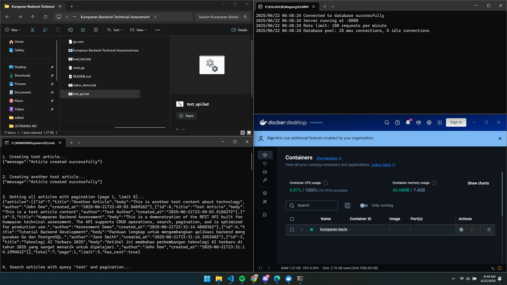

# Kumparan Backend Technical Assessment

REST API untuk manajemen artikel menggunakan Go, PostgreSQL, dan Docker.


## Tech Stack

- **Backend**: Go 1.23.3
- **Database**: PostgreSQL 15
- **Router**: Gorilla Mux
- **Containerization**: Docker & Docker Compose

## Setup & Installation

1. **Clone repository**
   ```bash
   git clone <repository-url>
   cd Kumparan-Backend-Technical-Assessment
   ```

2. **Start PostgreSQL dengan Docker**
   ```bash
   docker-compose up -d
   ```

3. **Setup database schema**
   ```bash
   # Create schema in the kumparan database
   docker exec -i kumparan-backend-technical-assessment-db-1 psql -U postgres -d kumparan < db/schema.sql
   ```
   
   Atau untuk PowerShell:
   ```powershell
   Get-Content db/schema.sql | docker exec -i kumparan-backend-technical-assessment-db-1 psql -U postgres -d kumparan
   ```
   
   Atau bisa copy paste isi schema.sql ke psql:
   ```sql
   CREATE TABLE IF NOT EXISTS articles (
       id SERIAL PRIMARY KEY,
       title TEXT NOT NULL,
       body TEXT NOT NULL,
       author TEXT NOT NULL,
       created_at TIMESTAMP DEFAULT CURRENT_TIMESTAMP
   );

   CREATE INDEX IF NOT EXISTS idx_articles_created_at ON articles(created_at DESC);
   CREATE INDEX IF NOT EXISTS idx_articles_author ON articles(author);
   CREATE INDEX IF NOT EXISTS idx_articles_title ON articles USING GIN(to_tsvector('english', title));
   CREATE INDEX IF NOT EXISTS idx_articles_body ON articles USING GIN(to_tsvector('english', body));
   ```

4. **Install dependencies**
   ```bash
   go mod download
   ```

5. **Run aplikasi**
   ```bash
   # Linux/Mac
   go run main.go
   
   # Atau build terlebih dahulu (Windows)
   go build
   .\Kumparan-Backend-Technical-Assessment.exe
   ```

Server akan berjalan di `http://localhost:8080`

## API Endpoints

### 1. Create Article
```http
POST /articles
Content-Type: application/json

{
    "title": "Judul Artikel", 
    "body": "Isi artikel yang panjang...",
    "author": "Nama Penulis"
}
```

**Response Success (201):**
```json
{
    "message": "Article created successfully"
}
```

### 2. Get All Articles (with Pagination)
```http
GET /articles
```

**Query Parameters:**
- `query` - Search dalam title dan body menggunakan full-text search
- `author` - Filter berdasarkan author
- `page` - Nomor halaman (default: 1)
- `limit` - Jumlah artikel per halaman (default: 10, max: 100)

**Contoh:**
```http
GET /articles?query=teknologi&author=john&page=2&limit=5
```

**Response Success (200):**
```json
{
    "articles": [
        {
            "id": 1,
            "title": "Judul Artikel",
            "body": "Isi artikel...",
            "author": "Nama Penulis",
            "created_at": "2025-06-22T10:30:00Z"
        }
    ],
    "total": 1000,
    "page": 2,
    "limit": 5,
    "has_next": true
}
```

### 3. Get Article by ID
```http
GET /articles/{id}
```

**Response Success (200):**
```json
{
    "id": 1,
    "title": "Judul Artikel",
    "body": "Isi artikel...",
    "author": "Nama Penulis", 
    "created_at": "2025-06-22T10:30:00Z"
}
```

### 4. Delete Article
```http
DELETE /articles/{id}
```

**Response Success (200):**
```json
{
    "message": "Article deleted successfully"
}
```

## Error Responses

- **400 Bad Request**: Input tidak valid
- **404 Not Found**: Article tidak ditemukan
- **429 Too Many Requests**: Rate limit exceeded (max 100 req/min)
- **500 Internal Server Error**: Server error

## Testing



Contoh testing dengan curl:

1. **Create Article**
   ```bash
   curl -X POST http://localhost:8080/articles \
     -H "Content-Type: application/json" \
     -d '{"title":"Test Article","body":"This is test content","author":"Test Author"}'
   ```

2. **Get All Articles**
   ```bash
   curl http://localhost:8080/articles
   ```

3. **Search Articles with Pagination**
   ```bash
   curl "http://localhost:8080/articles?query=test&author=Test&page=1&limit=5"
   ```

4. **Get Article by ID**
   ```bash
   curl http://localhost:8080/articles/1
   ```

5. **Delete Article**
   ```bash
   curl -X DELETE http://localhost:8080/articles/1
   ```

## Database Schema

```sql
CREATE TABLE IF NOT EXISTS articles (
    id SERIAL PRIMARY KEY,
    title TEXT NOT NULL,
    body TEXT NOT NULL,
    author TEXT NOT NULL,
    created_at TIMESTAMP DEFAULT CURRENT_TIMESTAMP
);

CREATE INDEX IF NOT EXISTS idx_articles_created_at ON articles(created_at DESC);
CREATE INDEX IF NOT EXISTS idx_articles_author ON articles(author);
CREATE INDEX IF NOT EXISTS idx_articles_title ON articles USING GIN(to_tsvector('english', title));
CREATE INDEX IF NOT EXISTS idx_articles_body ON articles USING GIN(to_tsvector('english', body));
```

## Struktur Project

```
├── main.go                 # Entry point aplikasi
├── go.mod                  # Go modules
├── docker-compose.yaml     # Docker configuration
├── db/
│   └── schema.sql         # Database schema
├── model/
│   └── article.go         # Article model
├── repository/
│   └── article_repository.go  # Database operations
└── handler/
    └── article_handler.go # HTTP handlers
```
